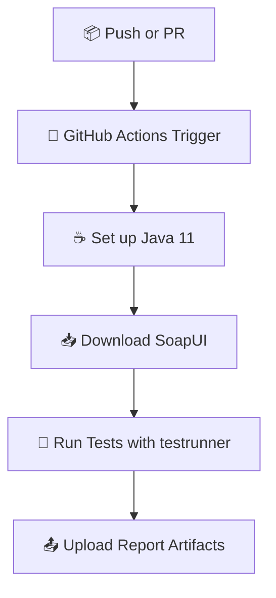

# 🧪 Users API Test - SoapUI + CI/CD Demo

<div align="center">

[](https://www.soapui.org/)
[](https://openjdk.org/projects/jdk/11/)
[](https://github.com/your-org/your-repo/actions)
[](LICENSE)

</div>

---

## 📋 Description

**Users API Test** is a lightweight project to demonstrate automated API testing using **SoapUI** and GitHub Actions.  
It validates a simple `GET` request to a public API (`/users/1`) and checks the expected response using assertions.

🎯 **Main Objective:**  
To showcase how to integrate functional REST API testing with SoapUI into a Continuous Integration workflow using GitHub Actions.

---

## 🛠️ Technologies Used

| Tool        | Purpose                           |
|-------------|-----------------------------------|
| 🧪 SoapUI    | REST API testing and assertions   |
| ☕ Java 11   | Required to run SoapUI             |
| 🐧 Ubuntu    | CI runner environment (GitHub Actions) |
| 🚀 GitHub Actions | Continuous Integration (CI/CD) |

---

## 🧩 Project Structure

```
users-api-test/
│
├── REST-Project-1-soapui-project.xml   # SoapUI project file with tests
├── .github/
│   └── workflows/
│       └── soapui.yml                  # CI/CD pipeline for test execution
└── README.md
```

---

## 🚀 Functional Test Logic

<table>
<tr>
<td>🔍</td>
<td><strong>GET /users/1</strong><br>Calls a public API and validates response fields.</td>
</tr>
<tr>
<td>✅</td>
<td><strong>Assertions</strong><br>Status Code 200 and JSON field <code>name == 'Leanne Graham'</code>.</td>
</tr>
<tr>
<td>🔁</td>
<td><strong>Automated</strong><br>Test suite is run on each commit or pull request.</td>
</tr>
</table>

---

## ▶️ How to Run the Tests Locally

### 1️⃣ Export your SoapUI project

```bash
# In SoapUI GUI
File > Export Project > Save as: REST-Project-1-soapui-project.xml
```

### 2️⃣ Run with SoapUI CLI (testrunner)

```bash
"C:\Program Files\SmartBear\SoapUI-5.8.0\bin\testrunner.bat" ^
  -sTestUsers -cGetUser ^
  -r -j -f reports ^
  REST-Project-1-soapui-project.xml
```

> 📝 Replace paths if needed, and ensure Java is installed.

---

## 🔄 CI/CD with GitHub Actions



✅ The CI workflow is defined in `.github/workflows/soapui.yml` and includes:
- Installing SoapUI on Ubuntu
- Running `testrunner.sh`
- Generating HTML and JUnit reports
- Uploading reports as artifacts

---

## 🤝 Contributing

Feel free to fork and improve this test pipeline!

### ✅ Contribution Checklist:
- [ ] Test passes locally (`testrunner`)
- [ ] Assertion logic is meaningful
- [ ] Commit message follows Conventional Commits
- [ ] Workflow runs successfully in GitHub Actions

---

## 📜 License

```
This project is for educational and training purposes only.
Created as part of the Agile Testing & DevOps learning module.
```

---

## 🙌 Credits

> Built by learners exploring the intersection of **API Testing** and **CI/CD automation**.  
> Powered by **SoapUI**, **GitHub Actions**, and **a passion for clean pipelines**.

---

<div align="center">

✨ **Test fast. Fail early. Deploy with confidence.** ✨

</div>
